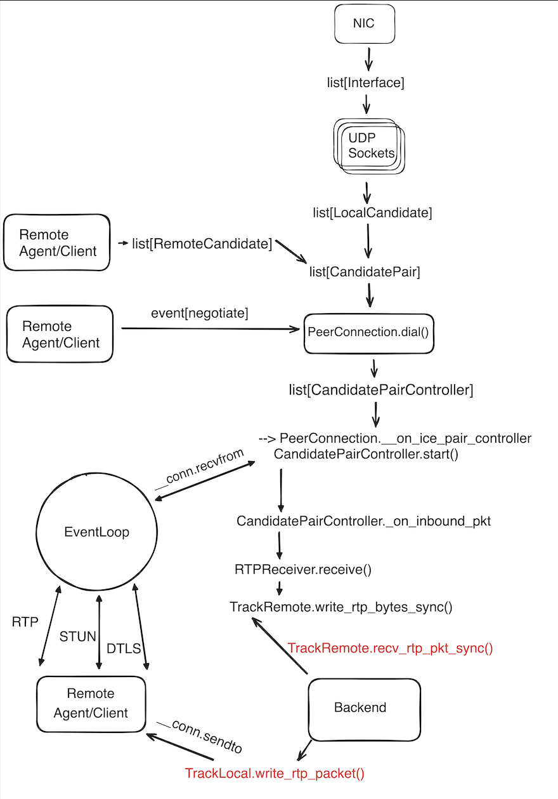

**Heavy experimental**

Working code at `old` branch.

Proof of concept that a WebRTC Media Server can (not) be implemented without too much code, large dependencies and coding/decoding of media.

### Features

- Established ICE and DTLS connection with a browser
- Sending/Receiving media in the Chrome browser
- Reading IVF container format with VP8 codec

### Build

```bash
rustup default nightly
```

Start rust module in watch mode:
```bash
make
```

poetry
```bash
poetry install && cd examples && poetry install && cd ..
```

In other term session (Also in watch mode for rust and python proj)
```bash
cd examples &&  make serve
```

### Install
```bash
docker compose up
```
```bash
cd web && npm install && npm run dev
```

## Architecture


## Credits

### [pion/webrtc](https://github.com/pion/webrtc)
Pure Golang implementation of the WebRTC protocol with zero dependencies. It has a well-decoupled architecture, but the complex implementation sometimes makes it difficult to figure out what's going on due to the abstraction. However, it also reduces the amount of code required to understand and work with it.
Also has been battle-tested in [livekit/livekit](https://github.com/livekit/livekit.git)

### [aiortc/aiortc](https://github.com/aiortc/aiortc)
Python implementation of the WebRTC protocol. It requires dependencies like libvpx or H.264 and Opus codecs, as well as other C/C++ libraries. It has an easy and simple architecture, which only requires [reading this draft diagram](https://draft.ortc.org/#overview*). 
There are many things to learn about media that are not in the context of WebRTC.

## Other Architecture approach
The problem with WebRTC is that you can't control the browser client side. I compiled Python as a WASM module and embedded it in the browser, but WASM doesn't have access to the network in the browser. However, browsers support HTTP over QUIC (WebTransport).

With this in mind, I tried to compile Python with Cython and then compile it to WASM with [Emscripten](https://github.com/emscripten-core/emscripten) and link the Python interpreter. However, these attempts were unsuccessful due to incorrect platform configuration for compiling Python.

Also browsers has WebCodecs which may helps with decoding/encoding media. But with WASM may be used native codecs implementations or even custom codecs based on ML

## License
MIT License - see [LICENSE](LICENSE) for full text
