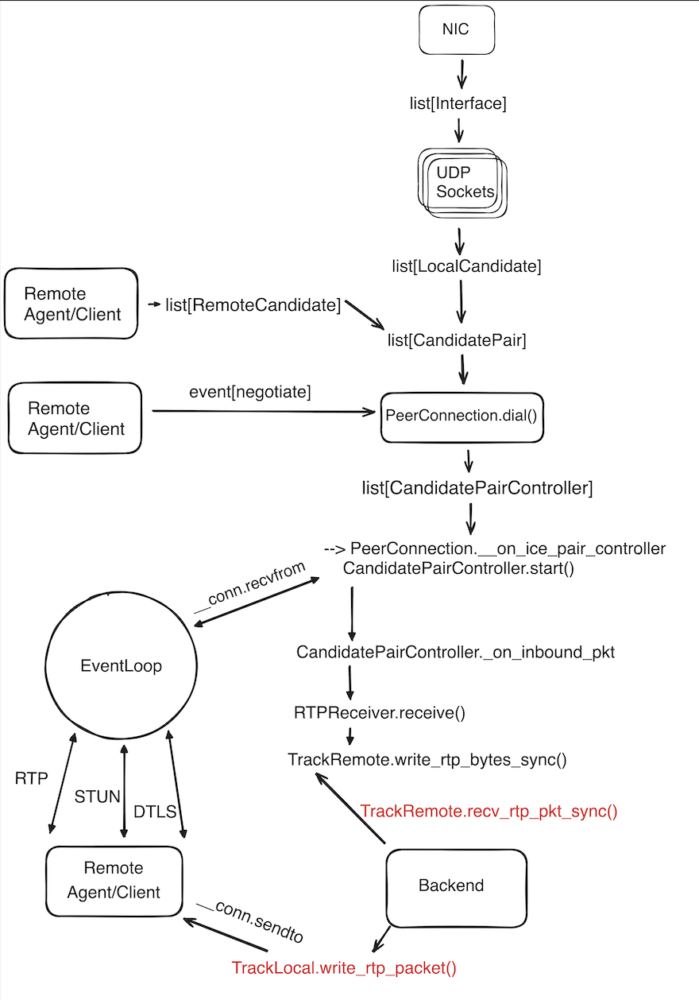

**Heavy experimental**

Working code at `old` branch.

Proof of concept that a WebRTC Media Server can (not) be implemented without too much code, large dependencies and coding/decoding of media.

### Features

- Established ICE and DTLS connection with a browser
- Sending/Receiving media in the Chrome browser
- Reading IVF container format with VP8 codec

### Build

```bash
rustup default nightly
```

Start rust module in watch mode:
```bash
make
```

poetry
```bash
poetry install && cd examples && poetry install && cd ..
```

In other term session (Also in watch mode for rust and python proj)
```bash
cd examples && make serve
```

The default server target builds and requires a compatible compiled native
event loop for the system-based project environment. Both regular GIL-enabled
and free-threaded CPython builds are supported; the artifact is compiled for
the running interpreter's exact ABI. The example Makefile consistently uses
`examples/.venv`, which contains the server and watcher dependencies.
For an explicit stock-asyncio run, use `cd examples && make serve-asyncio`.

### Native event-loop compiler performance

The event loop remains ordinary Python source, while required regions are
lowered into a CPython-3.13-specific native extension. Compiler work must stay
generic: optimization decisions come from IR operations, type/storage proofs,
annotations, and call-graph edges—not from scheduler class, method, or field
names.

The most effective optimization was not removing ownership accounting. It was
eliminating Python dispatch and temporary objects around external boundaries:

- Proven scalar locals use C `int64_t`, `Py_ssize_t`, `double`, or `int` slots.
  Only owned Python-object locals participate in the ownership mask.
- Native FIFO/heap truth and length operations write directly to C scalars.
- Same-receiver required-region calls use a guard-free status ABI. Unused
  results do not allocate a Python `None`.
- CPython type-version tags replace repeated descriptor-dictionary scans.
  A type mutation permanently sends that entry to the Python fallback.
- Existing frame locals and exact component fields are passed as borrowed
  pointers instead of being materialized and reference-counted again.
- Attribute names are interned and module-owned. Ordinary method calls use
  `PyObject_VectorcallMethod`, avoiding bound-method objects.
- Exact list iteration and tuple/list unpacking use indexed borrowed access.
- The proven Handle callback boundary uses cached type versions, descriptors,
  attribute names, and context vectorcall.
- Internal region bodies and local-name leaves are selectively inlineable.
  Broad expression inlining was measured and rejected because code growth
  reduced throughput.
- Heap annotations now carry a generic key representation contract, for
  example `storage.min_heap(key="_when", key_type=float, ...)`. Heaps without
  a proven key type remain boxed.
- Region `call_returns` metadata now puts external-call result proofs on IR
  call edges. Plain typed calls are checked and unboxed once; explicitly
  pinned CPython call ABIs can emit a native scalar directly. The scheduler
  uses this for monotonic time and float ULP; two-double extrema are expressed
  as typed control flow, eliminating Python calls and result objects from the
  timer arithmetic graph.
- Direct scalar reads can borrow and unbox an exact compatible value from
  boxed compatibility storage. This is required when a base initializer owns
  the original field representation; incompatible values still fail closed.

Short three-triple preflights showed the cumulative progression below. Each
cell is `native/asyncio` followed by `native/Python-reference`. These tiny runs
are directional and noisy; rows are cumulative artifacts, not isolated causal
measurements.

| Cumulative optimization stage | Cross-thread | Ready | Timers | UDP |
|---|---:|---:|---:|---:|
| Scalar locals | 0.647 / 0.485 | 0.305 / 0.350 | 0.491 / 0.675 | 0.637 / 0.835 |
| Typed scalar graph | 0.645 / 0.488 | 0.305 / 0.386 | 0.554 / 0.786 | 0.688 / 0.728 |
| Type-version guards | 0.705 / 0.541 | 0.326 / 0.409 | 0.602 / 0.731 | 0.724 / 0.829 |
| Method and interned-attribute fusion | 0.771 / 0.661 | 0.451 / 0.585 | 0.689 / 0.827 | 0.808 / 0.917 |
| Indexed object iteration | 0.843 / 0.674 | 0.492 / 0.585 | 0.633 / 0.809 | 0.803 / 1.002 |
| Handle type-version boundary | 0.831 / 0.667 | 0.728 / 0.868 | 0.683 / 0.862 | 0.828 / 0.922 |
| Context vectorcall | 0.838 / 0.627 | 0.774 / 1.009 | 0.661 / 0.915 | 0.767 / 0.981 |
| Region ABI inlining | 0.846 / 0.674 | 0.766 / 0.973 | 0.882 / 0.909 | 0.824 / 1.011 |
| Current direct Handle descriptors | 0.773 / 0.634 | 0.764 / 0.989 | 0.828 / 0.958 | 0.939 / 1.024 |
| Typed external returns | — | 0.807 / 1.053 | 0.646 / 0.876 | — |
| Native clock and float extrema | — | 0.883 / 1.162 | 0.814 / 0.898 | — |
| Typed numeric control flow | — | 0.776 / 0.979 | 0.787 / 1.028 | — |

A focused five-triple, 0.2-second run measured ready at `0.757 / 0.973`
and timers at `0.705 / 0.975`. Warmed native internal-allocation gates pass,
but the required `1.20x` one-sided throughput bound does not. Consequently the
artifact remains `performance_adopted = false`; these preflights must not be
presented as acceptance results.

External clock and numeric helper calls can now remain unboxed when their
source metadata pins a supported ABI. The next decisive limitation is broader
graph fusion: boxed public region returns and generic non-scalar call arguments
still force helper boundaries and scalar rematerialization. The short results
remain far below the `1.20x` acceptance requirement, so performance adoption
remains disabled.

An unguarded diagnostic artifact reached `0.821 / 1.071` for timers, but it
incorrectly ignored legal instance method overrides and was not retained. The
safe implementation checks the receiver instance dictionary without creating a
bound method and executes the ordinary Python call when overridden. A focused
five-triple timer run before the final control-flow rewrite remained noisy at
`0.737 / 0.978`; it did not justify the full acceptance suite.

See [`webrtc/compiler/AGENTS.md`](webrtc/compiler/AGENTS.md) for the complete
optimization ledger, rejected experiments, safety rules, and benchmark
workflow.

### Install
```bash
docker compose up
```
```bash
cd web && npm install && npm run dev
```

### UV
```bash
uv init --package packages/webrtc_rs --lib --build-backend maturin
```

Add remote repo from git:
```bash
uv add --editable git+https://github.com/romashorodok/webrtc-from-scratch/tree/main/examples
```

## Architecture


## Credits

### [pion/webrtc](https://github.com/pion/webrtc)
Pure Golang implementation of the WebRTC protocol with zero dependencies. It has a well-decoupled architecture, but the complex implementation sometimes makes it difficult to figure out what's going on due to the abstraction. However, it also reduces the amount of code required to understand and work with it.
Also has been battle-tested in [livekit/livekit](https://github.com/livekit/livekit.git)

### [aiortc/aiortc](https://github.com/aiortc/aiortc)
Python implementation of the WebRTC protocol. It requires dependencies like libvpx or H.264 and Opus codecs, as well as other C/C++ libraries. It has an easy and simple architecture, which only requires [reading this draft diagram](https://draft.ortc.org/#overview*). 
There are many things to learn about media that are not in the context of WebRTC.

## Other Architecture approach
The problem with WebRTC is that you can't control the browser client side. I compiled Python as a WASM module and embedded it in the browser, but WASM doesn't have access to the network in the browser. However, browsers support HTTP over QUIC (WebTransport).

With this in mind, I tried to compile Python with Cython and then compile it to WASM with [Emscripten](https://github.com/emscripten-core/emscripten) and link the Python interpreter. However, these attempts were unsuccessful due to incorrect platform configuration for compiling Python.

Also browsers has WebCodecs which may helps with decoding/encoding media. But with WASM may be used native codecs implementations or even custom codecs based on ML

## License
MIT License - see [LICENSE](LICENSE) for full text
